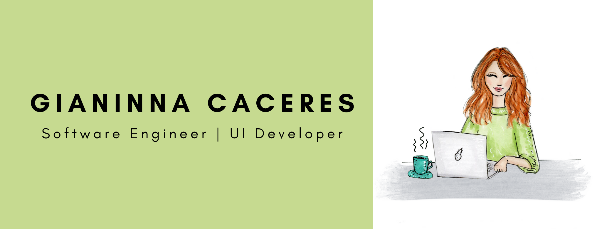

### Hi there 👋 :woman_technologist:

<!--
**caceresGianinna/caceresGianinna** is a ✨ _special_ ✨ repository because its `README.md` (this file) appears on your GitHub profile.

Here are some ideas to get you started:

- 🔭 I’m currently working on ...
- 🌱 I’m currently learning ...
- 👯 I’m looking to collaborate on ...
- 🤔 I’m looking for help with ...
- 💬 Ask me about ...
- 📫 How to reach me: ...
- 😄 Pronouns: ...
- ⚡ Fun fact: ...
-->

*Hello, I'm Gianinna!* A Software Engineer (Front-End) who is passionate about building software that solves challenging problems with simple solutions. I enjoy working with Angular, JavaScript, HTML, CSS, and Express. 

You can take a look at [My portfolio](https://caceresgianinna.github.io/portfolio2020/)

#### :computer: I’m currently working with: 
- Angular
- HTML
- CSS
- T-SQL
- .NET
- REST

#### 🌱 I’m currently learning:
- Python :snake:
- Express

#### I'm interested on learning:
- Python
- GraphQL

#### 📫 How to reach me: 
- [LinkedIn](https://www.linkedin.com/in/gicaceres/)

#### :speech_balloon: I speak:
- Español
- English
